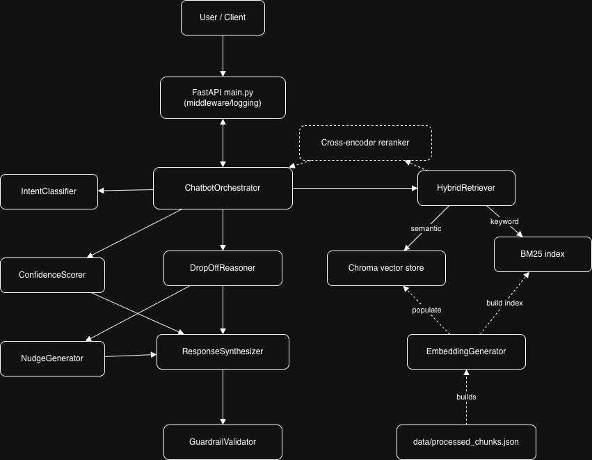

# Funnel Drop Chatbot

A production-grade GenAI-powered chatbot for fintech user journey optimization. Built to detect user drop-offs in high-friction funnels (KYC, OTP, PAN verification), understand drop-off reasons through intelligent analysis, and provide personalized nudges to guide users back into the flow.



---

## Table of Contents

1. [Problem Context](#problem-context)
2. [Key Features](#key-features)
3. [System Architecture](#system-architecture)
4. [Components Deep Dive](#components-deep-dive)
5. [API Endpoints](#api-endpoints)
6. [Installation & Setup](#installation--setup)
7. [Usage Examples](#usage-examples)
8. [Evaluation Framework](#evaluation-framework)
9. [Fine-Tuning / LoRA Design](#fine-tuning--lora-design)
10. [Design Decisions & Tradeoffs](#design-decisions--tradeoffs)
11. [Limitations & Future Work](#limitations--future-work)
12. [Project Structure](#project-structure)

---

## Problem Context

In fintech products, users frequently drop off during high-friction journeys:
- **KYC completion** (eKYC, VKYC)
- **PAN/Aadhaar verification**
- **Loan onboarding**
- **Merchant registration**
- **Credit limit enhancement**
- **Payment flows** (UPI/AutoPay/Mandate)

This chatbot addresses these challenges by:
1. **Detecting** where the user dropped off
2. **Understanding** why they may have dropped off (using RAG + reasoning)
3. **Providing intelligent nudges** and issue-resolution guidance
4. **Answering questions conversationally** with LLM + RAG
5. **Generating personalized advice** based on user state, product rules, and funnel logic

---

## Key Features

| Feature | Description |
|---------|-------------|
| **Hybrid RAG Pipeline** | Semantic (ChromaDB) + Keyword (BM25) retrieval with cross-encoder reranking |
| **Drop-Off Reasoning Engine** | Rule-based + LLM chain-of-thought analysis for accurate diagnosis |
| **Multi-Style Nudge Generation** | Explanatory, CTA-focused, empathetic, and compliance-safe variants |
| **Bilingual Support** | English + Hindi nudge generation |
| **Hallucination Prevention** | Low-confidence fallback responses and citation validation |
| **Compliance Guardrails** | Regex + LLM-based compliance checks on all outputs |
| **Modular Architecture** | Swappable LLMs (OpenAI/Claude/Llama) and Vector DBs |
| **Comprehensive Evaluation** | RAG relevance, hallucination rate, JSON correctness, latency, token cost |

---

## System Architecture

```
┌─────────────────────────────────────────────────────────────────────────────────┐
│                              FUNNEL DROP CHATBOT                                │
├─────────────────────────────────────────────────────────────────────────────────┤
│                                                                                 │
│  ┌─────────────┐    ┌──────────────────────────────────────────────────────┐   │
│  │   User /    │    │              CHATBOT ORCHESTRATOR                    │   │
│  │ API Client  │───▶│                                                      │   │
│  └─────────────┘    │  ┌────────────┐  ┌────────────┐  ┌───────────────┐   │   │
│                     │  │  Intent    │  │  Hybrid    │  │  Drop-Off     │   │   │
│  Endpoints:         │  │ Classifier │  │ Retriever  │  │   Reasoner    │   │   │
│  • /chat            │  └────────────┘  └────────────┘  └───────────────┘   │   │
│  • /predict_reason  │                                                      │   │
│  • /nudge_user      │  ┌────────────┐  ┌────────────┐  ┌───────────────┐   │   │
│  • /health          │  │  Nudge     │  │  Response  │  │   Guardrail   │   │   │
│                     │  │ Generator  │  │ Synthesizer│  │   Validator   │   │   │
│                     │  └────────────┘  └────────────┘  └───────────────┘   │   │
│                     └──────────────────────────────────────────────────────┘   │
│                                                                                 │
│  ┌──────────────────────────────┐    ┌──────────────────────────────────────┐  │
│  │       RETRIEVAL LAYER        │    │           KNOWLEDGE BASE             │  │
│  │                              │    │                                      │  │
│  │  ┌────────┐  ┌───────────┐   │    │  ┌─────────────┐  ┌──────────────┐   │  │
│  │  │ Chroma │  │   BM25    │   │◀───│  │  Processed  │  │   PDF/Doc    │   │  │
│  │  │ Vector │  │  Keyword  │   │    │  │   Chunks    │  │   Parsing    │   │  │
│  │  │  Store │  │   Store   │   │    │  │ + Metadata  │  │              │   │  │
│  │  └────────┘  └───────────┘   │    │  └─────────────┘  └──────────────┘   │  │
│  │        ▼                     │    │                                      │  │
│  │  ┌────────────────────────┐  │    │  • Funnel Steps        • Error Codes │  │
│  │  │  Cross-Encoder         │  │    │  • FAQs                • Call Starters│ │
│  │  │  Reranker              │  │    │  • Troubleshooting     • Offers      │  │
│  │  └────────────────────────┘  │    │                                      │  │
│  └──────────────────────────────┘    └──────────────────────────────────────┘  │
│                                                                                 │
└─────────────────────────────────────────────────────────────────────────────────┘
```

### Data Flow

1. **User Request** → API receives user state (stage, error codes, device, timestamp) + optional query
2. **Intent Classification** → LLM classifies user intent (question_about_drop, request_for_help, complaint, general_inquiry)
3. **Hybrid Retrieval** → Adaptive strategy selects semantic-heavy, keyword-heavy, or balanced search
4. **Cross-Encoder Reranking** → Top candidates refined using `ms-marco-MiniLM-L-6-v2`
5. **Confidence Scoring** → Low confidence triggers fallback: "I'm not fully sure — can you provide more details?"
6. **Drop-Off Reasoning** → Rules + LLM CoT produce primary/secondary reasons with confidence
7. **Nudge Generation** → 4 style variants (explanatory, CTA, empathetic, compliance-safe) + bilingual
8. **Response Synthesis** → Combine reasoning, nudges, steps, citations
9. **Guardrail Validation** → Compliance check before returning to user

---

## Components Deep Dive

### 1. RAG Pipeline

**Location:** `src/vector_store/`, `src/embeddings/`, `src/chunking/`

| Component | Implementation | Details |
|-----------|---------------|---------|
| **Semantic Chunking** | `ChunkingStrategy` | Structured chunks by funnel stage, FAQs, offers, call starters |
| **Metadata Enrichment** | `MetadataEnricher` | Stage, error codes, tone, action steps, timeline mentions |
| **Vector Embeddings** | OpenAI `text-embedding-3-small` (1536 dims) | Optimized text preparation per chunk type |
| **Keyword Fallback** | BM25Okapi | Preserves all-caps error codes (OCR_FAIL, OTP_TIMEOUT) |
| **Hybrid Retrieval** | `HybridRetriever` | RRF fusion of semantic + keyword ranks |
| **Reranking** | `CrossEncoderReranker` | `cross-encoder/ms-marco-MiniLM-L-6-v2` |
| **Adaptive Strategy** | Query analysis | Auto-selects weights based on error codes, technical terms, question words |

**Hallucination Prevention:**
- Low-confidence threshold (< 0.6) triggers explicit fallback message
- Citation validation ensures all cited chunk_ids exist in retrieved results
- Source grounding enforced in prompts

### 2. Drop-Off Reasoning Engine

**Location:** `src/reasoning/`

```python
# Rule-based hints for common patterns
RULE_BASED_HINTS = {
    ("VKYC", "OCR_FAIL"): "OCR quality issue during video KYC...",
    ("OTP", "OTP_TIMEOUT"): "OTP not received or expired...",
    ...
}

# Device-specific heuristics
DEVICE_HINTS = {
    ("VKYC", "android"): "Camera permissions or device-specific issues...",
    ("OTP", "ios"): "iOS SMS filtering or delayed delivery...",
    ...
}

# Time-based heuristics
TIME_BUCKET_HINTS = {
    "late_night": "Weaker network quality causing failures...",
    "peak_evening": "Peak traffic slowing verification...",
}
```

**Output Structure:**
```json
{
  "primary_reason": "PAN name mismatch during OCR validation",
  "secondary_reasons": ["Poor lighting", "Device camera quality"],
  "confidence": 0.86,
  "reasoning_chain": "Step 1: Analyzed error codes... Step 2: Checked device..."
}
```

### 3. Nudge Generation Engine

**Location:** `src/nudge/`

Generates **4 nudge variants**:

| Type | Purpose | Example |
|------|---------|---------|
| **Explanatory** | Educational, explains the issue | "Your KYC couldn't be verified because the PAN name didn't match your profile details." |
| **CTA-Focused** | Action-oriented, short | "Tap here to retry with a clearer photo →" |
| **Empathetic** | Reassuring, trust-building | "We understand this can be frustrating. Let's get you verified quickly!" |
| **Compliance-Safe** | Neutral, no guarantees | "Please re-upload your document. Processing typically takes 24-48 hours." |

**Bilingual Support:**
- All nudges generated in English first
- LLM translation to Hindi (or other languages) with tone preservation

**Compliance Validation:**
```python
FORBIDDEN_PATTERNS = [
    r"\bguarantee\b",
    r"\bfinancial advice\b",
    r"\b100%\s*(success|guarantee)?\b",
    r"\balways works\b",
    r"\bblame\b",
    r"\baccount number\b",  # PII protection
    ...
]
```

### 4. Chatbot Orchestration Layer

**Location:** `src/orchestration/`

```
ChatbotOrchestrator
├── IntentClassifier (LLM with few-shot examples)
├── HybridRetriever
│   ├── ChromaVectorStore
│   ├── BM25KeywordStore
│   └── CrossEncoderReranker
├── ConfidenceScorer
├── DropOffReasoner
├── NudgeGenerator
│   └── ComplianceValidator
├── ResponseSynthesizer
└── GuardrailValidator
```

**Modularity:**
- **LLM Swap:** Change `LLMClient` to point to OpenAI, Claude, or local Llama
- **Vector DB Swap:** Replace `ChromaVectorStore` with any DB implementing `query()` and `add_chunks()`
- **Reranker Swap:** Disable or replace `CrossEncoderReranker` for speed/accuracy tradeoffs

### 5. Intent Classifier

**Location:** `src/orchestration/intent_classifier.py`

Classifies user queries into:
- `question_about_drop` — "Why was my VKYC rejected?"
- `request_for_help` — "Please help me finish my KYC"
- `general_inquiry` — "What documents do I need?"
- `complaint` — "This process is frustrating"

Uses few-shot prompting with fallback heuristics.

---

## API Endpoints

### FastAPI Server (`api/main.py`)

| Endpoint | Method | Description |
|----------|--------|-------------|
| `/chat` | POST | Full conversational flow with reasoning + nudges |
| `/predict_reason` | POST | Retrieval + reasoning only |
| `/nudge_user` | POST | Generate personalized nudges |
| `/health` | GET | Health check |

### Request/Response Schemas

**UserState:**
```json
{
  "stage_dropped": "VKYC",
  "error_codes": ["OCR_FAIL", "PAN_GLARE"],
  "device_type": "Android",
  "timestamp": "2025-03-14T10:22:00Z",
  "language": "english"
}
```

**Chat Request:**
```json
{
  "user_state": { ... },
  "query": "Why did my video KYC fail?"
}
```

**Chat Response:**
```json
{
  "predicted_drop_reason": "OCR quality issue during video KYC",
  "explanation": "The document captured was blurry due to low lighting...",
  "nudge_messages": {
    "explanatory": { "nudge_text": "...", "compliance_check_passed": true },
    "cta_focused": { "nudge_text": "...", "compliance_check_passed": true },
    "empathetic": { "nudge_text": "...", "compliance_check_passed": true },
    "compliance_safe": { "nudge_text": "...", "compliance_check_passed": true }
  },
  "steps_to_fix": [
    "Ensure adequate lighting",
    "Hold document at eye level",
    "Avoid glare on the document"
  ],
  "confidence_score": 0.86,
  "citations": [
    { "chunk_id": "faq_0", "section": "faq" },
    { "chunk_id": "funnel_step_4", "section": "onboarding_funnel" }
  ],
  "conversational_message": "Here's what I found:\nPrimary reason: OCR quality issue...",
  "intent": { "intent": "question_about_drop", "confidence": 0.92 },
  "compliance": { "passed": true, "details": { "issues": [] } }
}
```

---

## Installation & Setup

### Prerequisites

- Python 3.10+
- OpenAI API key

### Step 1: Clone & Install

```bash
git clone https://github.com/your-username/funnel-drop-chatbot.git
cd funnel-drop-chatbot
python -m venv venv
source venv/bin/activate  # Windows: venv\Scripts\activate
pip install -r requirements.txt
```

### Step 2: Configure Environment

Create a `.env` file:
```env
OPENAI_API_KEY=your_openai_api_key_here
LLM_MODEL=gpt-4o-mini  # or gpt-4, gpt-3.5-turbo
```

### Step 3: Build Vector Store (if not present)

The vector store is pre-built in `data/vector_store/`. To rebuild:

```bash
python -c "from src.document_processing import process_and_store; process_and_store()"
```

### Step 4: Run the Server

```bash
uvicorn api.main:app --reload --host 0.0.0.0 --port 8000
```

### Step 5: Test the API

```bash
# Health check
curl http://localhost:8000/health

# Chat endpoint
curl -X POST http://localhost:8000/chat \
  -H "Content-Type: application/json" \
  -d '{
    "user_state": {
      "stage_dropped": "VKYC",
      "error_codes": ["OCR_FAIL"],
      "device_type": "Android",
      "language": "english"
    },
    "query": "Why did my video KYC fail?"
  }'
```

---

## Usage Examples

See `examples/sample_requests.py` for full examples:

```python
import requests

BASE_URL = "http://localhost:8000"

# Chat with context
response = requests.post(f"{BASE_URL}/chat", json={
    "user_state": {
        "stage_dropped": "VKYC",
        "error_codes": ["OCR_FAIL"],
        "device_type": "Android",
        "language": "english"
    },
    "query": "Why did my video KYC fail?"
})
print(response.json())

# Predict reason only
response = requests.post(f"{BASE_URL}/predict_reason", json={
    "stage_dropped": "OTP",
    "error_codes": ["OTP_TIMEOUT"],
    "device_type": "iOS"
})
print(response.json())

# Generate nudges
response = requests.post(f"{BASE_URL}/nudge_user", json={
    "user_state": {
        "stage_dropped": "eKYC",
        "error_codes": [],
        "device_type": "Android",
        "language": "hindi"
    },
    "nudge_type": "cta_focused",
    "language": "hindi"
})
print(response.json())
```

---

## Evaluation Framework

**Location:** `src/evaluation/`

### Metrics Measured

| Metric | Description | Latest Result |
|--------|-------------|---------------|
| **RAG Recall@5** | % of expected chunks in top-5 retrieved | **0.83** |
| **Hallucination Rate** | % of citations not in source | **0.00** |
| **JSON Correctness** | % of responses with valid schema | **1.00** |
| **Avg Latency** | Average response time | **975 ms** |
| **Avg Token Cost** | Average tokens per request | **$0.0045** |
| **Nudge Helpfulness** | LLM-as-judge score (1-5) | **4.27** |

### Run Evaluation

```bash
python -m src.evaluation.run_evaluation
```

Output saved to `data/eval_report.json`:
```json
{
  "timestamp": "2025-12-06T23:51:35.059969+00:00",
  "recall_at_5": 0.8333333333333334,
  "hallucination_rate": 0.0,
  "json_correctness": 1.0,
  "avg_latency_ms": 975.0,
  "avg_token_cost": 0.0045,
  "nudge_helpfulness": {
    "avg_score": 4.266666666666667,
    "count": 6
  },
  "cases_evaluated": {
    "rag_cases": 6,
    "responses": 6,
    "nudges": 6
  },
  "llm_judge_used": false
}
```

### LLM-as-Judge

Nudges evaluated on 4 dimensions:
- **Helpfulness** (1-5)
- **Clarity** (1-5)
- **Empathy** (1-5)
- **Compliance** (1-5)

---

## Fine-Tuning / LoRA Design

> **Note:** Actual training not executed; design is fully documented.

### Objectives

1. Improve grounding on funnel troubleshooting and error codes
2. Generate higher-quality bilingual nudges (English/Hindi)
3. Reduce hallucinations via domain-constrained responses
4. Ensure JSON-correct outputs for reasoning tasks

### Dataset Design

| Task Type | % of Dataset | Description |
|-----------|--------------|-------------|
| Drop-off Reasoning | 45% | user_state → JSON {primary_reason, secondary_reasons, confidence, reasoning_chain} |
| Nudge Generation | 25% | (reason, stage) → 4 styles + bilingual variants |
| Error-code Explanations | 20% | error_code + stage → cause + action steps |
| Multilingual Variants | 10% | English/Hindi translations with tone preservation |

- **Size:** 5-10k examples (synthetic + doc-derived)
- **Validation Split:** 10-15%
- **Format:** Chat-style SFT (system/user/assistant) in JSONL

### Model & Method

| Aspect | Choice |
|--------|--------|
| Base Model | Llama-3.1-8B-Instruct |
| Method | LoRA / QLoRA |
| Context Window | 8k tokens |
| Target Modules | q_proj, k_proj, v_proj, o_proj, gate_proj, up_proj, down_proj |

### Hyperparameters

```yaml
epochs: 3-5
batch_size: 64 tokens-per-device (gradient accumulation as needed)
learning_rate: 2e-4
scheduler: cosine with 5% warmup
lora_r: 64
lora_alpha: 128
lora_dropout: 0.1
max_seq_len: 2048
weight_decay: 0.01
gradient_clip: 1.0
precision: bf16
```

### Expected Improvements

| Metric | Baseline | Post-Fine-Tune Target |
|--------|----------|----------------------|
| Recall@5 | 0.83 | ≥ 0.90 |
| Hallucination Rate | 0.00 | ≤ 0.02 |
| JSON Correctness | 1.00 | ≥ 0.98 |
| Nudge Helpfulness | 4.27 | ≥ 4.4 |

### Training Notes

- Use de-identified, synthetic augmentation (no PII)
- Keep adapters separate from base weights
- Version adapters with data/commit hash
- Validate on held-out, doc-grounded set
- Abort if hallucination/JSON correctness regresses

---

## Design Decisions & Tradeoffs

### Decisions

| Decision | Rationale |
|----------|-----------|
| **Hybrid Retrieval (Chroma + BM25)** | Covers both semantic similarity and exact keyword matches (error codes like OCR_FAIL) |
| **Structured Chunking** | Funnel stage/FAQ/offers/call starters with enriched metadata enables filtering and rerank signals |
| **Cross-Encoder Rerank** | Improves precision at cost of latency (~100ms overhead) |
| **Regex + LLM Compliance** | Fast regex for obvious violations; optional LLM for nuanced checks |
| **Low-Confidence Fallback** | Fixed message reduces hallucination risk when retrieval is uncertain |

### Tradeoffs

| Tradeoff | Chosen | Alternative |
|----------|--------|-------------|
| Accuracy vs Speed | Cross-encoder ON | Disable reranker for 2x faster responses |
| Cost vs Quality | OpenAI gpt-4o-mini | Local Llama for zero API cost |
| Recall vs Precision | Balanced hybrid (0.5/0.5 default) | Keyword-heavy for technical queries |

---

## Limitations & Future Work

### Current Limitations

1. **Fine-tuning not executed** — Only design exists; no trained LoRA adapters
2. **Recall on edge cases** — Some specific scenarios (PAN glare, VKYC window close) need improved chunk coverage
3. **Latency** — ~1s average response time; could be reduced with caching
4. **Token cost tracking** — Not yet wired through API responses
5. **Limited Hindi coverage** — Translation quality varies; needs more native examples

### Future Work

- [ ] Execute LoRA training on curated dataset
- [ ] Add embedding cache for frequent queries
- [ ] Implement stage-aware retrieval boosts
- [ ] Expand Hindi coverage with native examples
- [ ] Add cost/latency instrumentation per API response
- [ ] Create PAN-upload specific nudges (glare/angle/lighting)
- [ ] Integrate A/B testing framework for nudge effectiveness

---

## Project Structure

```
funnel-drop-chatbot/
├── api/
│   ├── main.py              # FastAPI app with /chat, /predict_reason, /nudge_user
│   ├── schemas.py           # Pydantic models (UserState, ChatRequest, NudgeRequest)
│   └── middleware.py        # Request logging middleware
├── src/
│   ├── orchestration/
│   │   ├── chatbot_orchestrator.py   # Main pipeline coordinator
│   │   ├── intent_classifier.py      # LLM intent classification
│   │   ├── response_synthesizer.py   # Combine outputs into response
│   │   └── guardrail_validator.py    # Compliance checks
│   ├── reasoning/
│   │   ├── drop_off_reasoner.py      # Rule-based + LLM CoT reasoning
│   │   └── reasoning_prompts.py      # Chain-of-thought prompts
│   ├── nudge/
│   │   ├── nudge_generator.py        # Multi-style nudge generation
│   │   ├── nudge_prompts.py          # Nudge prompt templates
│   │   └── compliance_validator.py   # Regex + LLM compliance
│   ├── vector_store/
│   │   ├── chroma_store.py           # ChromaDB wrapper
│   │   ├── bm25_store.py             # BM25 keyword search
│   │   ├── hybrid_retriever.py       # Adaptive hybrid retrieval
│   │   ├── reranker.py               # Cross-encoder reranking
│   │   └── build_store.py            # Store construction utilities
│   ├── embeddings/
│   │   ├── embedding_generator.py    # OpenAI embeddings with optimization
│   │   └── embedding_config.py       # Model configuration
│   ├── chunking/
│   │   └── chunking.py               # Semantic chunking strategies
│   ├── rag/
│   │   └── confidence_scorer.py      # Retrieval confidence & citation validation
│   ├── llm/
│   │   └── llm_client.py             # Thin OpenAI wrapper (swappable)
│   ├── evaluation/
│   │   ├── metrics.py                # RAG relevance, hallucination, JSON correctness
│   │   ├── llm_judge.py              # LLM-as-judge for nudge scoring
│   │   └── run_evaluation.py         # Evaluation script
│   └── parsers/
│       └── document_parsers.py       # PDF/document parsing
├── data/
│   ├── vector_store/                 # ChromaDB persistent storage
│   ├── bm25_index.pkl               # Serialized BM25 index
│   ├── eval_report.json             # Latest evaluation results
│   ├── Assignment RAG_context_file.pdf   # Source document
│   └── GEN AI ENGINEER ASSIGNMENT FUNNEL DROP CHATBOT.pdf
├── docs/
│   ├── architecture.md              # System architecture details
│   ├── architecture_diagram.md      # Mermaid diagrams
│   ├── decisions.md                 # Design decisions & tradeoffs
│   ├── fine_tuning_design.md        # LoRA fine-tuning design
│   ├── fine_tuning_lora_design.md   # Detailed LoRA plan
│   └── evaluation_summary.md        # Evaluation results summary
├── tests/
│   ├── test_cases.json              # Sample test scenarios
│   ├── test_integration.py          # Integration tests
│   ├── test_orchestrator.py         # Unit tests for orchestrator
│   └── test_mandatory_master.py     # Mandatory requirement tests
├── examples/
│   └── sample_requests.py           # Example API calls
├── requirements.txt
├── LICENSE
└── README.md
```

---

## Running Tests

```bash
# All tests
pytest tests/

# Specific test file
pytest tests/test_orchestrator.py -v

# Integration tests (requires API running)
pytest tests/test_integration.py -v
```

---

## License

This project is licensed under the MIT License. See [LICENSE](LICENSE) for details.

---

## Acknowledgments

- Built for the GenAI Engineer Assignment
- Uses OpenAI GPT-4o-mini for LLM operations
- ChromaDB for vector storage
- Sentence Transformers for cross-encoder reranking
