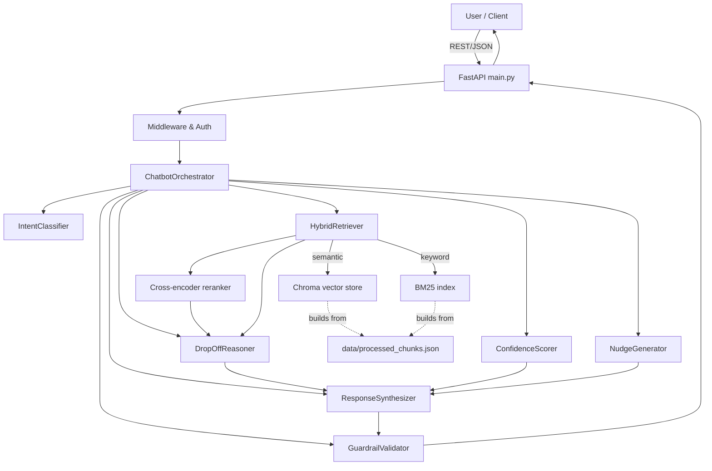

System architecture (chatbot)
=============================

Data flow highlights
--------------------
- Hybrid retrieval (Chroma + BM25) feeds reranker, then reasoning + nudge generation.
- Guardrails wrap final responses; citations validated before returning to the client.

